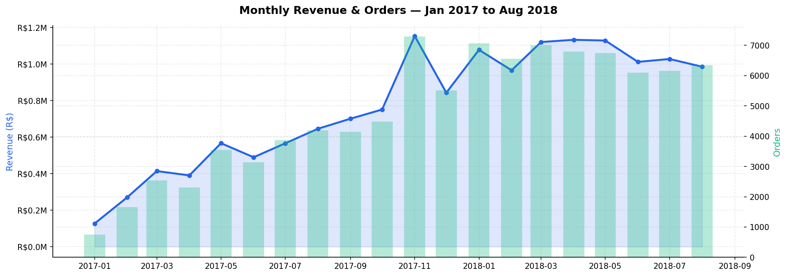
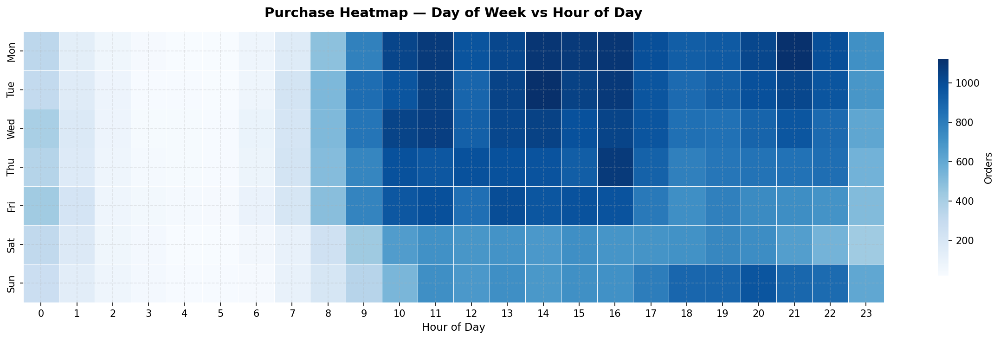
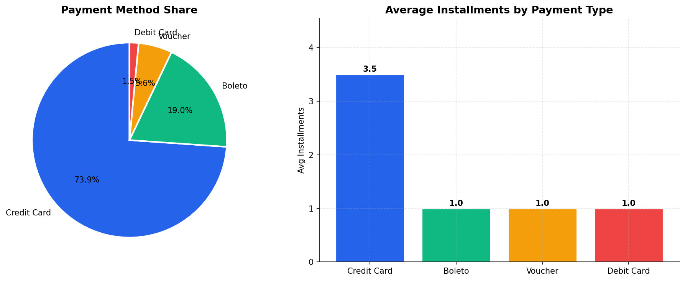
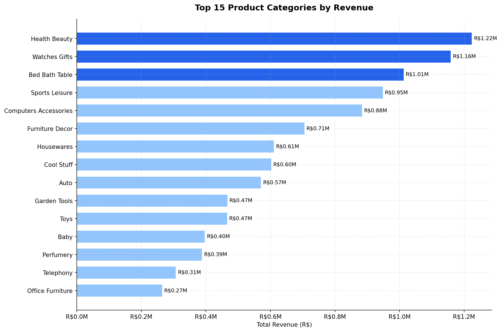
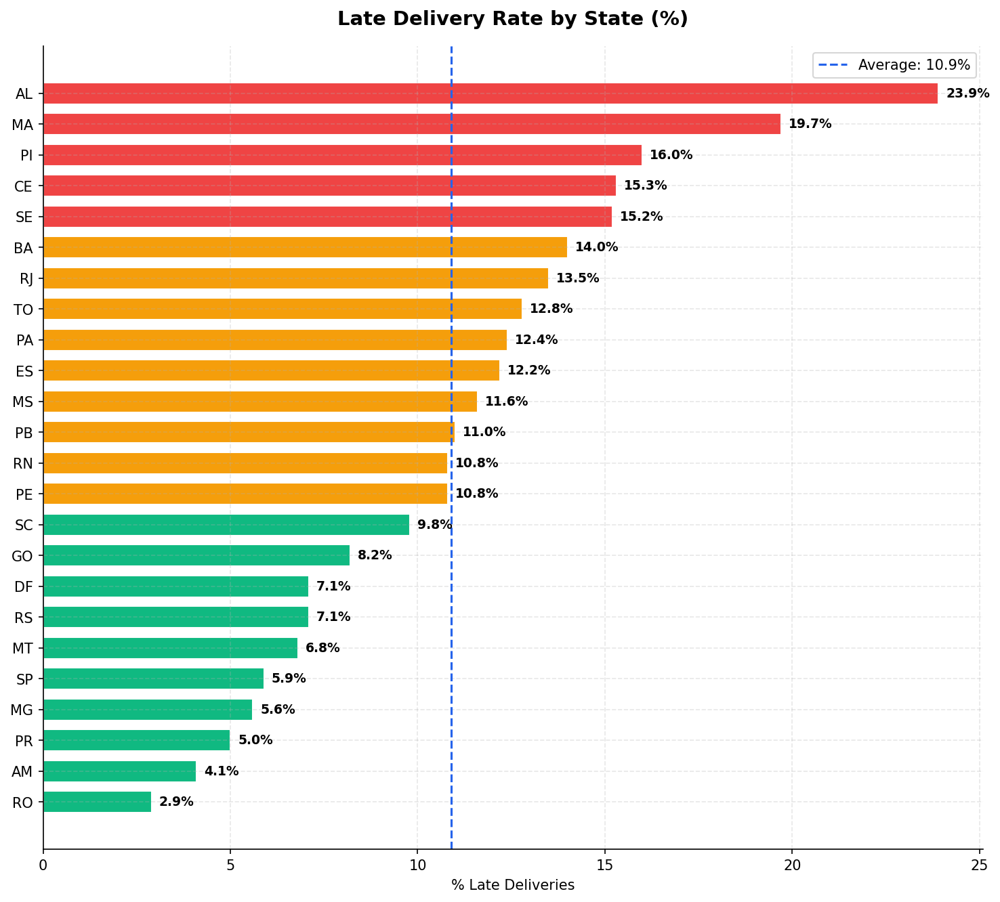
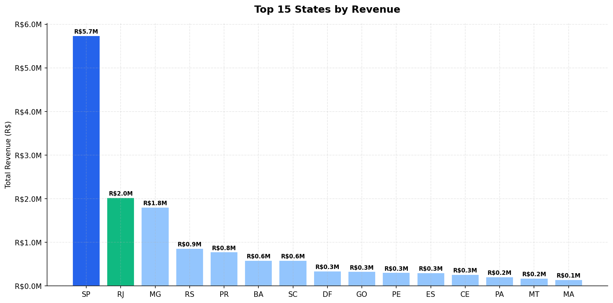

# Brazilian E-Commerce (End-to-End Data Project)

A complete, production-style data engineering and analytics pipeline built on the [Olist Brazilian E-Commerce dataset](https://www.kaggle.com/datasets/olistbr/brazilian-ecommerce), featuring automated ETL, PostgreSQL modeling, SQL analytics, and 13 visualizations.


## Project Overview

| Layer | What I built | Tools |
|---|---|---|
| **Data Engineering** | ETL pipeline (extract → transform → load) | Python, pandas, PostgreSQL |
| **Data Analysis** | 16 SQL queries + 13 visualizations | PostgreSQL, matplotlib, seaborn |

This project simulates a real-world analytics workflow: raw CSV ingestion, data cleaning, referential integrity checks, database modeling, analytical SQL, and business insights.

## Project Structure

```
brazilian-ecommerce-project/
│
├── pipeline/                        # Layer 1 — ETL Pipeline
│   ├── extract.py                   # Validates & loads 9 raw CSV files
│   ├── transform.py                 # Cleans & standardizes all tables
│   ├── load.py                      # Loads cleaned data into PostgreSQL
│   ├── pipeline.py                  # Runs full ETL in one command
│   └── schema.sql                   # PostgreSQL table definitions
│
├── analysis/                        # Layer 2 — EDA & Visualizations
│   ├── eda_export_queries.sql       # 16 analytical SQL queries
│   ├── visualizations.py            # Generates 13 charts from query results
│   ├── query_results/               # CSV exports from pgAdmin
│   └── charts/                      # Generated PNG charts
│
├── data/
│   ├── e_dataset/                   # Raw CSVs (gitignored)
│   └── e_dataset_cleaned/           # Cleaned CSVs (gitignored)
│
├── pass.env                         # DB credentials (gitignored)
├── .gitignore
└── README.md
```

## Dataset

**Source:** [Olist Brazilian E-Commerce — Kaggle](https://www.kaggle.com/datasets/olistbr/brazilian-ecommerce)

9 CSV files covering 100,000+ orders placed between 2016 and 2018:

| Table | Rows | Description |
|---|---|---|
| customers | 99,441 | Customer location and ID |
| orders | 99,441 | Order status and timestamps |
| order_items | 112,650 | Products per order, price, freight |
| order_payments | 103,875 | Payment type and installments |
| order_reviews | 98,673 | Customer review scores and comments |
| products | 32,951 | Product dimensions and category |
| sellers | 3,095 | Seller location |
| geolocation | 738,305 | Brazilian zip code coordinates |


## Layer 1: ETL Pipeline

### How to run
```bash
# Install dependencies
pip install pandas numpy sqlalchemy psycopg2-binary python-dotenv

# Run full pipeline (extract → transform → load)
python pipeline/pipeline.py

# Or run each step separately
python pipeline/extract.py
python pipeline/transform.py
python pipeline/load.py
```

### Setup
Create a `pass.env` file in the project root:
```
DB_HOST=localhost
DB_PORT=5432
DB_NAME=olist_db
DB_USER=postgres
DB_PASSWORD=your_password
```

### Key cleaning decisions

| Table | What was cleaned |
|---|---|
| orders | Parsed 5 date columns, fixed 23 illogical delivery dates |
| order_items | Removed negative prices, flagged 1,117 price outliers |
| order_payments | Dropped 11 invalid rows (bad payment type or zero value) |
| order_reviews | Kept latest review per order, dropped 551 duplicates |
| geolocation | Filtered to Brazil bounding box, removed 261,858 duplicates |
| products | Merged English category translations, validated dimensions |

### Referential Integrity: all checks passed
```
orders → customers           orphans: 0
order_items → orders         orphans: 0
order_payments → orders      orphans: 0
order_reviews → orders       orphans: 0
order_items → products       orphans: 0
order_items → sellers        orphans: 0
```

## Layer 2: SQL Analysis

16 analytical queries covering:

- **Revenue trends:** monthly growth, cumulative revenue
- **Customer behaviour:** segmentation, RFM scoring, spend distribution
- **Delivery performance:** late rate by state, actual vs estimated days
- **Product insights:** top categories, price tier analysis
- **Seller performance:** rankings using RANK(), DENSE_RANK(), window functions
- **Geography:** revenue by state, cross-state order flow

### Key findings

| Finding | Insight |
|---|---|
| Revenue grew 8× | From R$127K (Jan 2017) to R$1.1M (Jan 2018) |
| Top category | Health & Beauty — R$1.2M revenue |
| Peak purchase time | Monday–Tuesday, 10am–4pm |
| Payment preference | 74% use credit card, avg 3.5 installments |
| Late delivery rate | 8.1% of orders delivered late |
| Worst state for delays | Alagoas (AL) — 23.9% late delivery rate |
| Late → bad reviews | Sellers with 20%+ late rate score avg 3.8 vs 4.25 |
| Customer retention | 96.9% of customers only buy once |

### Charts:











### Generate all charts
```bash
pip install matplotlib seaborn
python analysis/visualizations.py
# → Saves 13 charts to analysis/charts/
```

## Tech Stack

| Tool | Purpose |
|---|---|
| Python 3.9+ | ETL pipeline and visualizations |
| pandas | Data cleaning and transformation |
| PostgreSQL 18 | Database storage and SQL analysis |
| SQLAlchemy | Python ↔ PostgreSQL connection |
| matplotlib / seaborn | Data visualization |
| python-dotenv | Secure credential management |


## Quick Start

```bash
# 1. Clone the repo
git clone https://github.com/hassan-akhter/brazilian-ecommerce-project
cd brazilian-ecommerce-project

# 2. Download the dataset from Kaggle and place CSVs in data/e_dataset/

# 3. Install dependencies
pip install pandas numpy sqlalchemy psycopg2-binary python-dotenv matplotlib seaborn

# 4. Create pass.env with your PostgreSQL credentials

# 5. Run the full pipeline
python pipeline/pipeline.py

# 6. Run analysis queries in pgAdmin using analysis/eda_export_queries.sql

# 7. Generate visualizations
python analysis/visualizations.py
```


## Author

**Hassan**  -- Data Engineering Portfolio Project

Dataset: Olist Brazilian E-Commerce Public Dataset (Kaggle)
